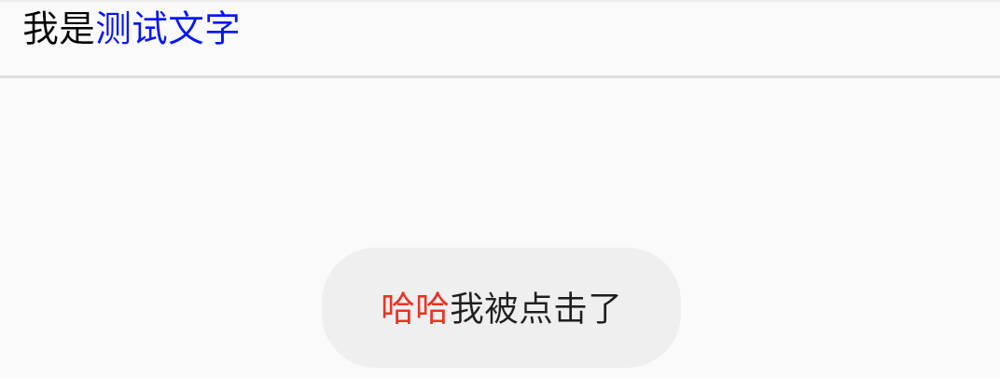
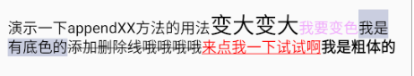
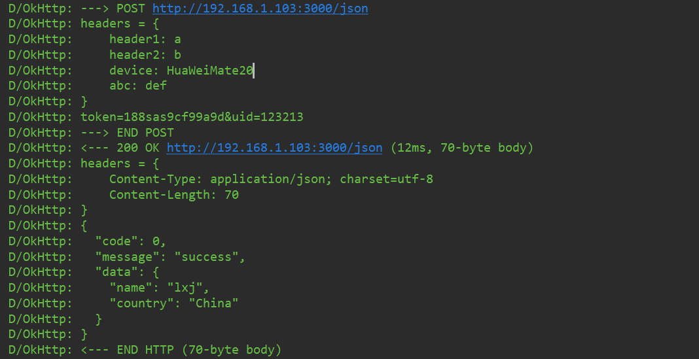
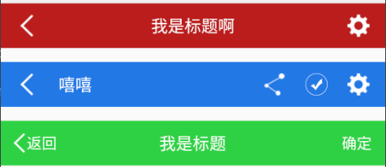
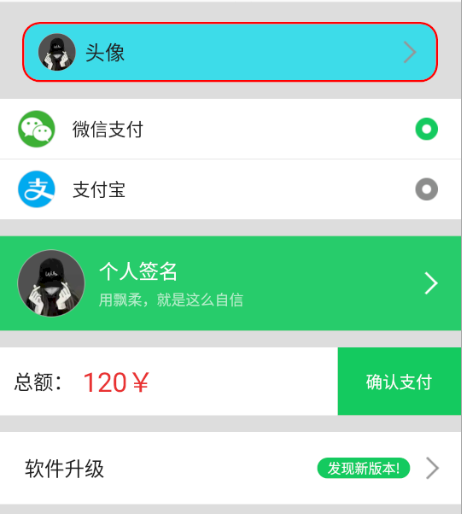
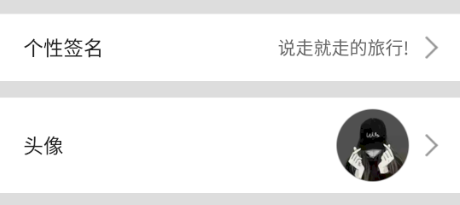

## AndroidKTX


Some very useful kotlin extensions for android development !

一系列非常有用的Kotlin扩展和组件，目标提高Android开发速度和替换所有的工具类！注意这个不是官方的AndroidKTX ！

## Gradle
[](https://bintray.com/li-xiaojun/jrepo/androidktx/_latestVersion)

```
implementation 'com.lxj:androidktx:1.2.10'
//for androidx
implementation 'com.lxj:androidktx:1.2.10-x'
```


## Usage

### 初始化
使用之前需要先初始化，初始化的作用是初始默认配置和注入Context。
```kotlin
// 简单注册，保持默认配置
AndroidKtxConfig.init(this)
// 也可以详细注册，自定义配置
AndroidKtxConfig.init(context = this,
        isDebug = BuildConfig.DEBUG,
        defaultLogTag = "logTag",
        sharedPrefName = "spName")
```

### Hash相关
我们使用hash的时候，大都是对字符串操作，所以给String增加了扩展方法，用法如下：
```kotlin
"123456".md5()  // E10ADC3949BA59ABBE56E057F20F883E
"123456".sha1()  // 7C4A8D09CA3762AF61E59520943DC26494F8941B
"123456".sha256()  // 8D969EEF6ECAD3C29A3A629280E686CF0C3F5D5A86AFF3CA12020C923ADC6C92
"123456".sha512()  // BA3253876AED6BC22D4A6FF53D8406C6AD864195ED144AB5C87621B6C233B548BAEAE6956DF346EC8C17F5EA10F35EE3CBC514797ED7DDD3145464E2A0BAB413
// 随机数增强哈希
"123456".md5Hmac(salt)  // 4270C88B36C8D232DC2098FE0287A490
"123456".sha1Hmac(salt)  // E3DDE36BBDF2CA05A96DBE11BDE696FEF00C4299
"123456".sha256Hmac(salt)  // 12FC58997EA2FBD1861E1FBD4AFD5D69321A122BAB6FBD1695A2820B42D7F7B8

// 对称加密解密
//DES的key必须是8位
"123456".encryptDES("aaaabbbb")  //TQEoRuLPiHo=
"TQEoRuLPiHo=".decryptDES("aaaabbbb")  //123456
//AES的key必须是16位
"123456".encryptAES("aaaabbbbaaaabbbb")  //3FiQmdsD3GCuAManeaW/yg==
"3FiQmdsD3GCuAManeaW/yg==".decryptAES("aaaabbbbaaaabbbb")  //123456
```


### Log相关
我们输出的log大都是字符串，所以也是给String增加扩展方法，用法如下：
```kotlin
"我是测试".v()
"我是测试".i()
"我是测试".w()
"我是测试".d()
"我是测试".e()
```

> Log的默认tag和开关配置在AndroidKtxConfig类中，可动态配置。

或者这样使用：
```kotlin
logv("msg")
logd("tag", "aaa")
loge("tag", "aaa")
```


### Span相关
封装了颜色，大小，背景色，删除线和点击等常用的文本装饰，使用对象是TextView和String。用法如下：
```kotlin
val str = "我是测试文字"
textView.sizeSpan(str, 0..2)
textView.sizeSpan(str, 0..2, scale = .7f) //改变scale可以控制放大或缩小，scale默认是1.5
```


```kotlin
textView.colorSpan(str,2..6)
```


```kotlin
textView.backgroundColorSpan(str,2..6)
```


```kotlin
textView.strikeThrougthSpan(str,2..6)
```

```kotlin
textView.clickSpan(str = str, range = 2..6, color = Color.BLUE, clickAction = {
    toast("哈哈我被点击了".toColorSpan(0..2))
})
```

```kotlin
textView.styleSpan(str, range) //加粗，斜体等效果
```

`appendXX`系列方法，其实在实际项目中append系列方法会用的更多，用法按如下：
```kotlin
tv.text = "演示一下appendXX方法的用法"
tv.appendSizeSpan("变大变大")
        .appendColorSpan("我要变色", color = Color.parseColor("#f0aafc"))
        .appendBackgroundColorSpan("我是有底色的", color = Color.parseColor("#cacee0"))
        .appendStrikeThrougthSpan("添加删除线哦哦哦哦")
        .appendClickSpan("来点我一下试试啊", isUnderlineText = true, clickAction = {
            toast("哎呀，您点到我了呢，嘿嘿")
        } )
        .appendStyleSpan("我是粗体的")
```



### View相关
```kotlin
view.width(100)           // 设置View的宽度为100
view.widthAndHeight(100)  // 改变View的宽度和高度为100
view.animateWidthAndHeight(600,900) //带有动画
view.animateWidth(600,900, action = { //监听动画进度，执行可选操作 }) //带有动画
view.margin(leftMargin = 100)  // 设置View左边距为100
view.click { toast("aa") }    // 设置点击监听，已实现事件节流，350毫秒内只能点击一次
view.longClick {             // 设置长按监听
    toast("long click")
    true
}
view.gone()
view.visible()
view.invisible()
view.isGone  // 属性
view.isVisible // 属性
view.isInvisible // 属性
view.toggleVisibility() // 切换可见性
view.toBitmap()           // 获取View的截图，支持RecyclerView长列表截图
// 遍历子View
layout.children.forEachIndexed { index, view ->

}
```

### ImageView相关
```kotlin
// 底层是封装Glide来加载图片，内部已解决Glide的CenterCrop导致圆角失效的问题
imageView.load(url)
imageView.load(url, placeholder = R.mipmap.ic_launcher, isCircle = true)
imageView.load(url, placeholder = R.mipmap.ic_launcher, roundRadius = 20)
```

### RecyclerView相关
对RecyclerView的使用进行了极其简洁的封装，再也不用写Adapter。
```kotlin
recyclerView.vertical() //设置垂直
            //.vertical(spanCount = 2, isStaggered = true) //设置垂直2列瀑布流
            .divider(color = Color.RED, size = 1) //设置分割线
            // 绑定数据，只需传数据和布局，然后实现绑定的方法，再也不用写Adapter
            .bindData(data, R.layout.adapter_rv) { holder, t, position ->
                holder.setText(R.id.text, "模拟数据 - $t")
                        .setImageResource(R.id.image, R.mipmap.ic_launcher_round)
            }
            .addHeader(headerView) //必须在bindData之后调用
            .addFooter(footerView) //必须在bindData之后调用
            .itemClick<String> { data, holder, position ->
                toast("click ${data[position]}")
            }

//notify
//recyclerView.adapter.notifyItemChanged()


// 多条目类型
recyclerView.vertical()
            .divider(color = Color.RED)
            .multiTypes(data, listOf(OneItem(), TwoItem()))
            .addHeader(headerView) //必须在multiTypes之后调用
            .addFooter(footerView) //必须在multiTypes之后调用
            .itemClick<String> { data, holder, position ->
                toast("click ${data[position]}")
            }
// 实现多个Item类型
class OneItem : ItemViewDelegate<String>{
        override fun bind(holder: ViewHolder, t: String, position: Int) {
            holder.setText(android.R.id.text1, t)
        }
        override fun isForViewType(item: String, position: Int): Boolean {
            return true
        }
        override fun getLayoutId(): Int {
            return android.R.layout.simple_list_item_1
        }
    }
class TwoItem : ItemViewDelegate<String>{
    override fun bind(holder: ViewHolder, t: String, position: Int) {
        holder.setText(android.R.id.text1, t)
    }
    override fun isForViewType(item: String, position: Int): Boolean {
        return true
    }
    override fun getLayoutId(): Int {
        return android.R.layout.simple_list_item_1
    }
}
```


### SharedPref相关
使用范围：Context
```kotlin
// 便捷处理
sp().getString("a", "default")
sp().getBoolean("b", false)
sp(name = "xxx.cfg").getBoolean("b", false)
//...

// 批处理
sp().edit {
    putString("a", "1")
    putBoolean("b", true)
}
// 清除
sp().clear()
```

### MMKV集成
**MMKV**是微信开源的跨平台KV存储方案，支持跨进程。经过微信的长期实践和优化，是目前Android平台性能最高，最成熟稳定的KV存储方案。完全可以替代SharedPreference。
MMKV的API本身已经被设计得很简洁，我也只是简单集成下。

使用范围：Any
```kotlin
mmkv(id = "user").putString("b", "cc")
mmkv().putString("a", "1231")
mmkv().getFloat("f", 123f)
mmkv().clearAll()

mmkv().addToList("a", "哈哈", isReplace = true) // 实现了有序且去重，去重由isReplace决定
mmkv().getList("a")
mmkv().removeFromList("a", "呵呵")

// list操作也支持对象类型
mmkv().addToList("b", User(name = "lxj"), isReplace = true) // 实现了有序且去重，去重由isReplace决定
mmkv().getList("b")
mmkv().removeFromList("b", User(name = "lxj"))

// 其他略过
```

### Activity相关
使用范围：Activity和Fragment，以及Context对象，会自动检测Context是否为Activity，并自动添加`FLAG_ACTIVITY_NEW_TASK`
```kotlin
startActivity<MainActivity>()
// 启动Activity并传参
startActivity<MainActivity>(flag = Intent.FLAG_ACTIVITY_CLEAR_TOP, bundle = arrayOf(
        "a" to 1,
        "b" to "lala"
))
// 在Fragment中启动Activity
fragment.startActivity<MainActivity>()
// 使用非Activity的Context启动，内部会自动检测并添加FLAG_ACTIVITY_NEW_TASK，不会导致崩溃
applicitionCtx.startActivity<MainActivity>(bundle = arrayOf(
        "a" to 1,
        "b" to "lala"
))
// 在View中启动
view.startActivity<MainActivity>()
```

### Fragment相关
使用范围：Activity和Fragment
```kotlin
//替换一个Fragment不传参
replace(R.id.frame1, TempFragment())
//替换一个Fragment并传参数
replace(R.id.frame1, TempFragment(), arrayOf(
                TempFragment.Key1 to "我是第一个Fragment",
                TempFragment.Key2 to "床前明月光"
        ))
//添加Fragment
add(R.id.frame1, AFragment())
//其他方法，show, hide, remove略过

//fragment批处理，自动commit
fragmentManager {
    add(R.id.container, TempFragment())
    hide(fragment)
    replace(R.id.container, TempFragment())
}
```

### 字符串处理相关
使用范围：String对象
```kotlin
"13899990000".isPhone()  // 是否是电话号码
"aaa@aas.com".isEmail()  // 是否是邮箱地址
"41282119900909337z".isIDCard()   // 是否是身份证号码
"洒水".isChinese()      // 是否是汉字
```


### 时间日期处理
```kotlin
// 默认格式：yyyy-MM-dd HH:mm:ss
"2018-12-07 17:28:39".toDateMills()  // 字符串日期转毫秒
(1544174919000L).toDateString()      // 毫秒转字符串日期

// 自定义格式
"2018-12-07".toDateMills(format = "yyyy-MM-dd")
(1544174919000L).toDateString(format = "yyyy-MM-dd")
```


### OkHttp极简封装
对`OkHttpUtils`和`OkGo`都不满意，于是造了一个。

- 请求示例
```kotlin
GlobalScope.launch {
    //Get请求
    val user = "http://192.168.1.103:3000/json".http().get<User>().await()
    //Post请求，传递header和params
    val user = "http://192.168.1.103:3000/json".http()
                    .headers("device" to "HuaWeiMate20", ...)
                    .params("token" to "188sas9cf99a9d",
                        "file" to file,  //上传文件
                         ...)
                    .post<User>()
                    //.postJson(json) 直接传json字符串，目前post和put支持直传json
                    //.putJson(json) 直接传json字符串，目前post和put支持直传json
                    .await()
}
```
`GlobalScope.launch`开启的协程并不会自动取消，如果想要自动取消协程，请看看我的文章：https://juejin.im/post/5ceb3d6ef265da1bb47d4180

上面的示例需要在协程中使用；也是我最喜欢和最推荐的方式。如果你不用协程，则可以用`callback style`：
```kotlin
"http://192.168.1.103:3000/json".http().get(object : HttpCallback<String> {
        override fun onSuccess(t: String) {
        }
        override fun onFail(e: IOException) {
            super.onFail(e)
        }
    })
```
下载文件和进度：
```kotlin
"https://github.com/li-xiaojun/XPopup/archive/master.zip"
            .http()
            .savePath(Environment.getExternalStorageDirectory().toString() + "/xxx.zip")
            .downloadListener(onProgress = {
                loge("download progress: ${it?.percent}")
            })
            .get<File>()
            .await()
```

- Http日志

内置了简洁实用的Http日志打印器，效果如下：


- 其他
```kotlin
        // 设置自定义的Client
OkWrapper.setClient(...)
        // 设置全局header
        .headers("header1" to "a", "header2" to "b", ...)
        // 设置拦截器
        .interceptors(...)
        .baseUrl("https://lixiaojun.xin")

// 取消请求
"http://192.168.1.103:3000/json".http(tag = "abc").get<String>() //需要先指定tag
OkWrapper.cancel("abc")
```

### LiveDataBus相关
基于LiveData的事件总线，好处是：轻量，无内存泄露，自动解注册。
```kotlin
// 接收消息
LiveDataBus.with<String>("key1").observe(this, observer = Observer {
    it?.v()
})
// 发送消息
LiveDataBus.with<String>("key1").setValue("message1")
```

内置实用类：
1. OnceLiveData: 只执行一次的LiveData
2. StateLiveData: 携带状态的LiveData
```kotlin
// observe data.
vm.userData.observe(this, Observer { 
    // data change
})
// observe state
vm.userData.state.observe(this, Observer { 
    when(it){
        StateLiveData.State.Idle -> toast("idle")
        StateLiveData.State.Loading -> showProgress("idle")
        StateLiveData.State.Success -> toast("success")
        StateLiveData.State.Error -> toast("fail")
    }
})
```
3. LifecycleHandler: 自动在UI销毁时移除msg和任务，避免内存泄露的Handler


### 通用扩展
- toast相关
```kotlin
ctx/fragment/view.toast("测试短吐司")
ctx/fragment/view.longToast("测试长吐司")
```

- dp和px转换：
```kotlin
ctx/fragment/view/holder.dp2px(100)
ctx/fragment/view/holder.px2dp(100)
ctx/fragment/view/holder.sp2px(100)
ctx/fragment/view/holder.px2sp(100)
//动态创建图片
ctx/fragment/view/holder.createDrawable(color = Color.GREEN,
                                         strokeColor = Color.RED,
                                         strokeWidth = dp2px(2f),
                                         radius = dp2px(30f).toFloat(),
                                         enableRipple = true)
```

- Json转换相关：
```kotlin
User("李晓俊", 25).toJson()   // {"age":25,"name":"李晓俊"}
// 底层是Gson解析，但是不用传class或者TypeToken了，得益于Kotlin的reified功能
"{\"age\":25,\"name\":\"李晓俊\"}".toBean<User>()
// 集合类型需要这样写
"[{\"age\":25,\"name\":\"李晓俊\"}]".toBean<List<User>>()
```

- Resource获取相关
```kotlin
context/fragment/view/holder.string(R.string.app_name) // 获取字符串
context/fragment/view/holder.stringArray(R.array.array) // 获取字符串数组
context/fragment/view/holder.color(R.id.color)    //获取颜色
context/fragment/view/holder.drawable(R.mipmap.ic_launcher) // 获取图片
context/fragment/view/holder.dimenPx(R.dimen.abc) // 获取dp值
```

- 网络相关
```kotlin
context.isNetworkConnected()  // 当前是否有网络连接
context.isWifiConnected()     // 当前是否是WIFI连接
context.isMobileConnected()   // 当前是否是移动数据连接
```

- window相关
```kotlin
ctx/fragment/view/holder.windowWidth()
ctx/fragment/view/holder.windowHeight()
```

- TextView相关

给TextView增加sizeDrawable方法，用于给TextView的drawable设置大小：
```kotlin
tv.sizeDrawable(dp2px(20), topDrawable = R.mipmap.ic_launcher)
```

- ViewPager相关

让ViewPager变成卡片缩放效果：
```kotlin
pager.asCard() //通过参数可以调节卡片的距离和大小
```
设置adapter绑定数据：
```kotlin
viewPager.bind(10, bindView = {container, position ->
    return@bind TextView(this)
})
```

- Bitmap相关

将Bitmap保存到相册：
```kotlin
bitmap.saveToAlbum()
```


## 通用控件
- TitleBar
通用的标题栏控件，具体使用看属性便知，右边最多支持3个按钮。


使用示例：
```xml
<com.lxj.androidktx.widget.TitleBar
    android:layout_marginTop="15dp"
    app:title="嘻嘻"
    android:id="@+id/tt"
    app:titleAlignLeft="true"
    app:leftImageSrc="@mipmap/fh2"
    app:rightImageSrc="@mipmap/setting"
    app:rightImagePadding="15dp"
    app:rightImage2Src="@mipmap/zhifuwacheng"
    app:rightImage3Src="@mipmap/fx"
    app:titleColor="#fff"
    android:background="#2079E5"
    android:layout_width="match_parent"
    android:layout_height="wrap_content" />
```

点击监听：
```kotlin
//titleBar点击事件
tt.clickListener(object : TitleBar.ClickListener{
    override fun leftTextClick() {
        toast("left text")
    }
    override fun leftImageClick() {
        toast("left image")
    }
    override fun rightTextClick() {
        toast("right text")
    }
    override fun rightImageClick() {
        toast("right image")
    }
    override fun rightImage2Click() {
        toast("right image22")
    }
    override fun rightImage3Click() {
        toast("right image333")
    }
})
```

- SuperLayout
用来实现常见的横向图文布局，使用它配合几个属性，可以轻松实现以下效果：



基本使用：
```xml
<com.lxj.androidktx.widget.SuperLayout
    android:layout_marginLeft="20dp"
    android:layout_marginRight="20dp"
    android:paddingLeft="14dp"
    android:paddingRight="15dp"
    android:paddingTop="10dp"
    android:paddingBottom="10dp"
    android:layout_marginTop="15dp"
    app:sl_leftImageSrc="@drawable/avatar"
    app:sl_leftText="头像"
    app:sl_leftTextColor="#222"
    app:sl_leftTextSize="18sp"
    app:sl_rightImageSrc="@mipmap/jt"
    app:sl_solid="#3EDCE9"
    app:sl_corner="15dp"
    app:sl_strokeWidth="2dp"
    app:sl_stroke="#f00"
    android:layout_width="match_parent"
    android:layout_height="wrap_content"/>
```
其他用法看属性名即可，无需多说。


- SizedTextView
可以在布局文件中直接修改Drawable大小的TextView。
```xml
<com.lxj.androidktx.widget.SizedTextView
    android:layout_marginTop="20dp"
    android:text="哈哈"
    app:drawableSize="40dp"
    android:gravity="center"
    android:drawableLeft="@mipmap/ic_launcher"
    android:layout_gravity="center_horizontal"
    android:layout_width="wrap_content"
    android:layout_height="wrap_content" />
```


- ShapeFrameLayout，ShapeLinearLayout，ShapeRelativeLayout，ShapeTextView等可以设置背景，圆角，水波纹的布局


## 注意事项

为了覆盖各种使用场景，该库对常用类库进行了封装，因此依赖了很多三方库。依赖的所有三方库如下：
```groovy
implementation "com.github.bumptech.glide:glide:4.8.0"
api "org.jetbrains.kotlinx:kotlinx-coroutines-core:1.1.1"
api 'com.lxj:easyadapter:1.1.1'
implementation 'com.google.code.gson:gson:2.8.5'
// inline函数在运行时插入使用处，需要暴露出去
api "com.squareup.okhttp3:okhttp:3.12.1"
implementation "android.arch.lifecycle:extensions:1.1.1"
api 'com.tencent:mmkv:1.0.17'
```

由于我依赖的三方库都是最新版本，可能与您当前项目中的类库版本不一致，有可能导致因为API变化而编译失败。此时需要排除我这个库中的依赖，假设我的Glide版本与你项目中的不一致，则需要在gradle中配置如下：
```groovy
implementation ('com.lxj:androidktx:latest release version') {
        exclude group: 'com.github.bumptech.glide'
}
```


## TODO
- 其他常用方法集成


## 意见收集
为了让这个库更好用，更快地加速Android开发，请到Issue中提出您宝贵的意见或建议。我将对其进行评估，如果合适，立即采用。


## 联系方式
**QQ: 16167479**

**Email: 16167479@qq.com**